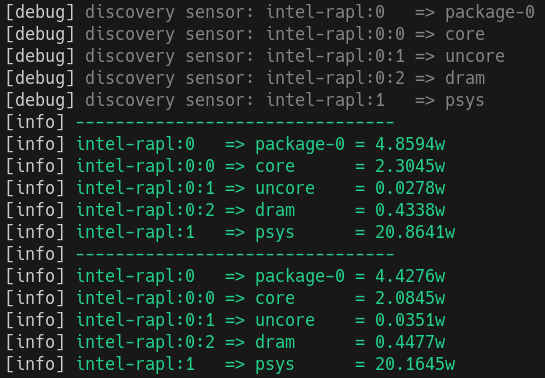

# Intel Running Average Power Limit (RAPL) Monitor

A tool used to display real-time power consumption of each component.



## How to use

Provided a static compiled version in releases.

```shell
make build
sudo make run
```
